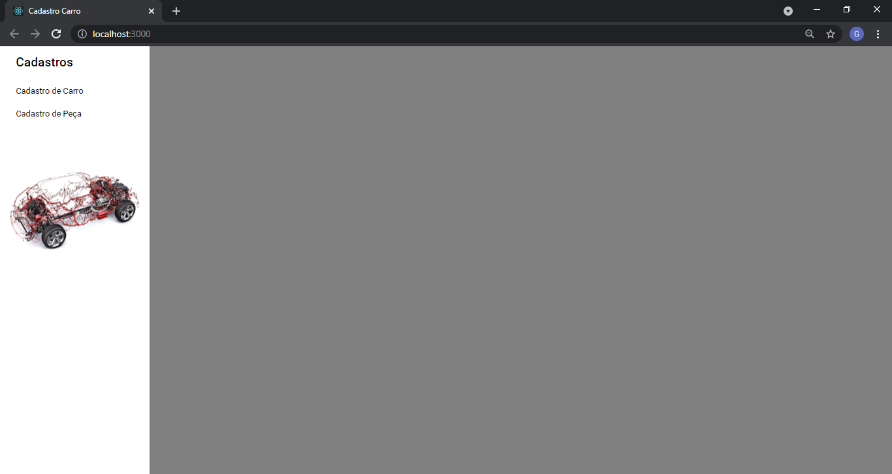
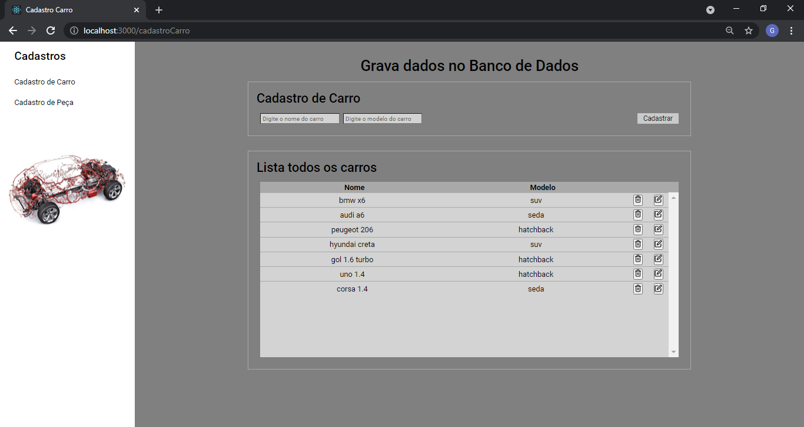
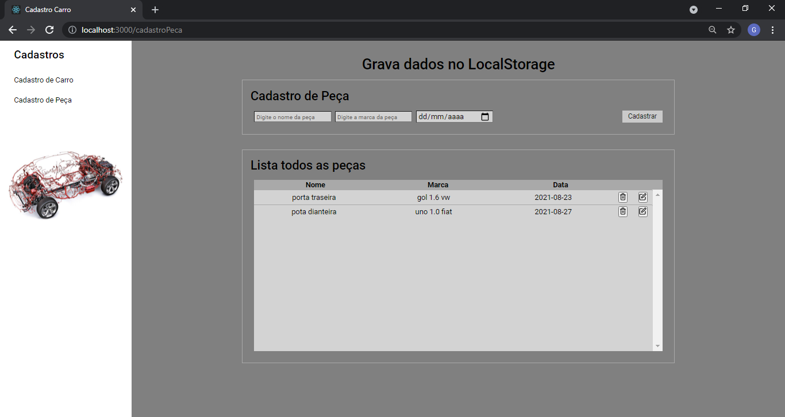

<h1 align="center">Formulário de Cadastro</h1>
<p align="center">Cadastro para salvar dados no Banco de Dados e no Local Storage</p>

<h4 align="center">
	🚧   Concluído 🚀 🚧
</h4>

<p align="center">
 <a href="#-sobre-o-projeto">Sobre</a> •
 <a href="#-funcionalidades">Funcionalidades</a> •
 <a href="#-layout">Layout</a> •
 <a href="#-como-executar-o-projeto">Como executar</a> •
 <a href="#-tecnologias">Tecnologias</a> •
 <a href="#-autor">Autor</a> •
 <a href="#-licença">Licença</a> •
</p>

### Features

- [x] Cadastro de carro
- [x] Cadastro de peça

## 💻 Sobre o projeto

Faz um CRUD (create, read, update e delete) tanto para consumir uma api como para utilizar o Local Storage.

---

## ⚙️ Funcionalidades

<h3>Cadastro de Carro</h3>
<p>A tela de Cadastro de Carro salva os dados em um Banco de Dados. Precisa do arquivo formcadastro-Backend, que se encontra no meu github</p>

<h3>Cadastro de Peça</h3>
<p>A tela de Cadastro de Peça salva os dados no Local Storage, não precisando instalar nem fazer conexão com Banco de Dados</p>

---

## 🎨 Layout







<div>
  
  <span>Excluir a linha do item</span>
</div>

<div>
  
  <span>Altera a linha do item. Joga os dados nos determinado campos, o usuáio faz a alteração e clica no botão Cadastrar</span>
</div>


---

## 🚀 Como executar o projeto

Este projeto é divido em duas partes:
1. Backend
2. Frontend

💡Para a parte de Cadastro de Carro - do Frontend, precisa que o Backend esteja sendo executado para funcionar.

### Pré-requisitos

Antes de começar, você vai precisar ter instalado em sua máquina as seguintes ferramentas:
[Git](https://git-scm.com), [Node.js](https://nodejs.org/en/), [Mysql](https://www.mysql.com/downloads/), [DBeaver](https://dbeaver.io/).
Além disto é bom ter um editor para trabalhar com o código como [VSCode](https://code.visualstudio.com/)

#### 🎲 Rodando o Backend (servidor)

```bash

# Clone este repositório
$ git clone git@github.com:gustavo-gnunes/README-ecoleta.git

# Acesse a pasta do projeto no terminal/cmd
$ cd formcadastro-Backend

# Instale as dependências
$ npm install

# Execute a aplicação em modo de desenvolvimento
$ npm run dev:server

# O servidor inciará na porta:3333 - acesse http://localhost:3333

```

#### 🧭 Rodando a aplicação web (Frontend)

```bash

# Clone este repositório
$ git clone git@github.com:gustavo-gnunes/README-ecoleta.git

# Acesse a pasta do projeto no seu terminal/cmd
$ cd formcadastro-react

# Instale as dependências
$ npm install

# Execute a aplicação em modo de desenvolvimento
$ npm run start

# A aplicação será aberta na porta:3000 - acesse http://localhost:3000

```

---

## 🛠 Tecnologias

As seguintes ferramentas foram usadas na construção do projeto:

#### **Website**  ([React](https://reactjs.org/)  +  [TypeScript](https://www.typescriptlang.org/))

-   **[React Router Dom](https://github.com/ReactTraining/react-router/tree/master/packages/react-router-dom)**
-   **[React Icons](https://react-icons.github.io/react-icons/)**
-   **[Axios](https://github.com/axios/axios)**

> Veja o arquivo  [package.json](https://github.com/gustavo-gnunes/formcadastro-react/blob/main/package.json)

---

## 🦸 Autor

 
 <br />
 <sub><b>Gustavo Genaro</b></sub>
 <br />

[](https://www.linkedin.com/in/gustavo-genaro-b715396a/)

---

## 📝 Licença

Este projeto esta sobe a licença [MIT](./LICENSE).

---
